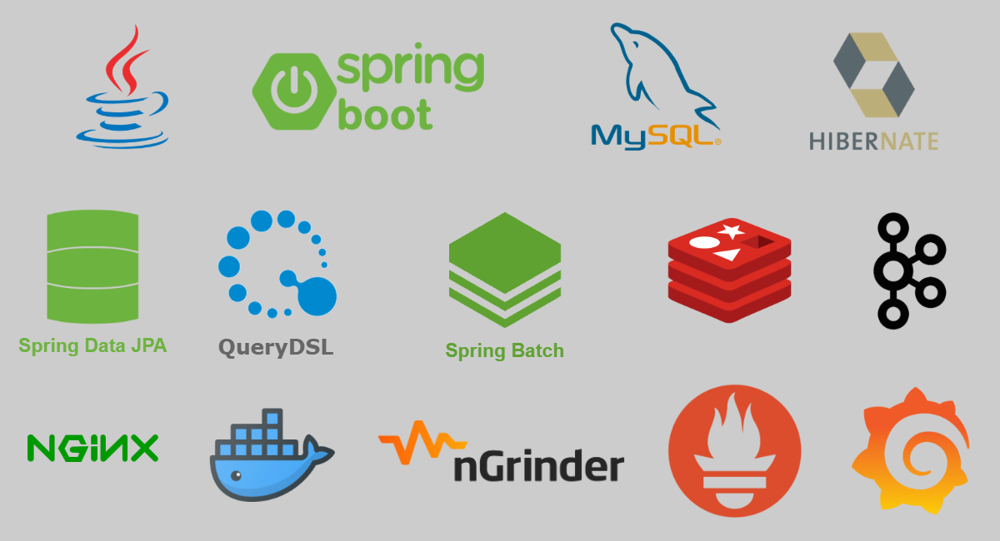
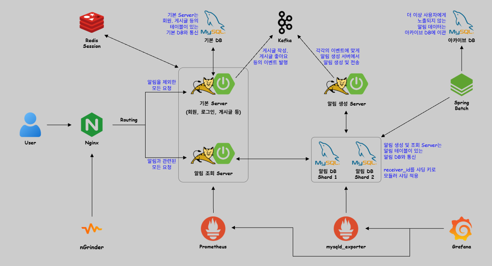

# CelFeed

 

## 1. 소개
**CelFeed**(Celeb + Feed)는 셀럽 전용 SNS를 가정해 개발한 백엔드 API 프로젝트입니다.

셀럽이 게시글을 작성하면 팬들에게 알림이 전송되고, 팬이 게시글에 좋아요를 누르면 셀럽에게 알림이 전달됩니다.
이처럼 알림 이벤트를 중심으로 알림 기능 구현에 중점을 두었습니다.

 

## 2. 사용 기술 & 아키텍처
 사용 기술
  

 아키텍처
- 사용자의 요청은 Nginx에서 경로에 따라 **기본 서버** 또는 **알림 조회 서버**로 라우팅됩니다.
- **알림 생성 서버**는 외부에 노출되지 않고, 기본 서버(Producer)에서 발생한 이벤트가 Kafka로 전달되면 알림 생성 서버(Consumer)가 이벤트를 처리합니다.
- **기본 DB**에는 회원, 게시글 등의 테이블이 존재하며, **알림 DB**에는 샤딩을 적용했습니다.

 

## 3. ERD

  

## 4. 알림 서버의 발전
1. [JdbcTemplate : 벌크 INSERT 최적화](docs/issues/issue1.md)
2. [알림 생성 서버와 조회 서버의 분리 : 장애 전파 차단](docs/issues/issue2.md)
3. [Thread Pool 기반 알림 생성 비동기 처리 : 응답 시간 단축](docs/issues/issue3.md)
4. [Message Queue 도입 : 알림 데이터 보호](docs/issues/issue4-0.md)
   - [[Querydsl] Cursor-based Pagination](docs/issues/issue4-1.md)
5. [알림 테이블 파티셔닝 : 데이터 조회 및 삭제 쿼리 속도 향상](docs/issues/issue5-0.md)
   - [[JPA] 복합 키와 @GeneratedValue를 함께 사용할 수 없는 제약](docs/issues/issue5-1.md)
   - [[Spring Batch] 대량의 알림 데이터 이관](docs/issues/issue5-2.md)
6. [알림 DB 샤딩 : 트래픽 분산](docs/issues/issue6-0.md)
   - [[JPA] Snowflake ID 키 생성기 적용](docs/issues/issue6-1.md)
   - [[JPA] 샤딩 적용 과정에서 발생한 알림 엔티티의 연관관계 문제](docs/issues/issue6-2.md)

 

## 5. 공통 처리
- [Spring Interceptor를 활용한 공통 로그인 체크](docs/commons/common1.md)
- [HandlerMethodArgumentResolver를 활용하여 로그인 ID 쉽게 가져오기](docs/commons/common2.md)
- [@ExceptionHandler를 활용한 공통 예외 처리 (ft. HandlerExceptionResolver)](docs/commons/common3.md)
- [공통 응답 포맷](docs/commons/common4.md)
